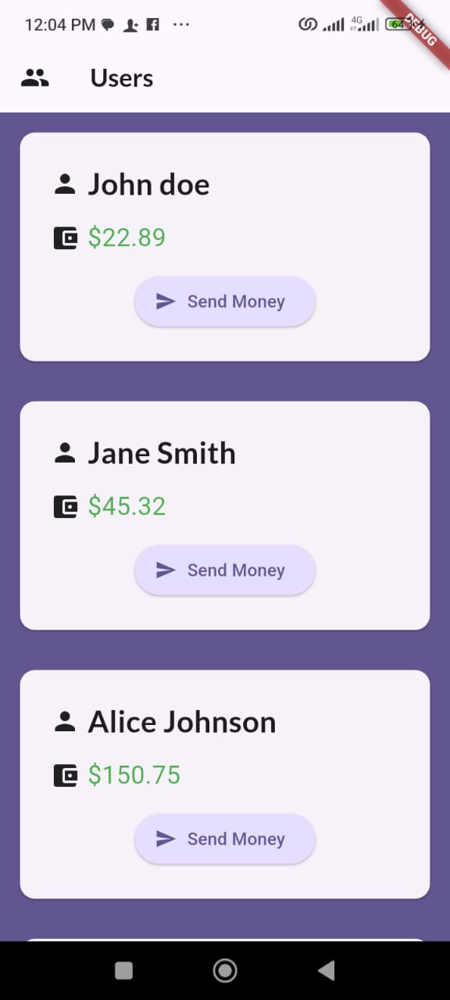

# Money Card App

## Overview
The **Money Card App** is a Flutter-based mobile application that displays user details such as name and balance on cards. The app also provides a "Send Money" feature that prints to the console when clicked. This app is designed to demonstrate the basic concepts of Flutter development, including UI design, state management, and the use of widgets such as `AppBar`, `Card`, `ElevatedButton`, and more.

## Features
- **User Details**: Displays the name and balance of the user on a beautifully styled card.
- **Send Money**: A button that prints a message to the console when clicked.
- **Custom AppBar**: Includes a title and an icon, with customizable background color.
- **Clean Layout**: The user information is displayed in a clean, responsive design using `ListView` for easy scrolling.

## Screenshots


## Technologies Used
- **Flutter**: Used for building the cross-platform mobile app.
- **Google Fonts**: Lato font style is used throughout the app to enhance the UI.
- **Widgets**: Utilizes `AppBar`, `Card`, `ElevatedButton`, `ListView`, and `Icon` for creating the user interface.

## Getting Started

To get started with this app, follow these steps:

### Prerequisites

Make sure you have the following installed:

- [Flutter SDK](https://flutter.dev/docs/get-started/install)
- [Dart SDK](https://dart.dev/get-dart)
- [Android Studio](https://developer.android.com/studio) or any preferred IDE

### Installation

1. Clone the repository:

   ```bash
   git clone https://github.com/TemiladeRebecca/money_card.git
   cd money_card
   ```

2. Install dependencies:

   ```bash
   flutter pub get
   ```

3. Run the app:

   ```bash
   flutter run
   ```

---

## 📊 Project Structure

```
lib/
├── main.dart
├── data       
├── screens/          # Screens (user details)
├── widgets/               

```

## 📜 License

This project is open-source and available under the [MIT License](LICENSE).

---

## 👨‍💻 Author

- **Talabi Rebecca**  
  [LinkedIn](https://linkedin.com/in/talabirebecca-virtualdev) | [GitHub](https://github.com/TemiladeRebecca)
